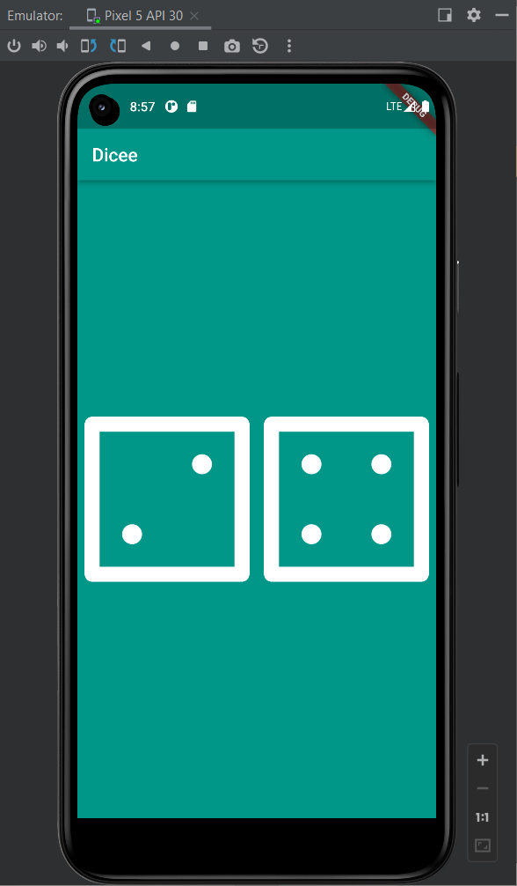

# Dice Flutter
It is my 3rd flutter app while learning the flutter.

## Functionality:

It generate the Random pair of Dice Numbers while clicking on it.

## Learning 

I have learned and Used in this Project

1.  Statefull Widget

2.  Variable

3.  Dart:math

4.  Random

5.  Functions

6.  Text Button

7.  Expanded

## Final Screenshot

